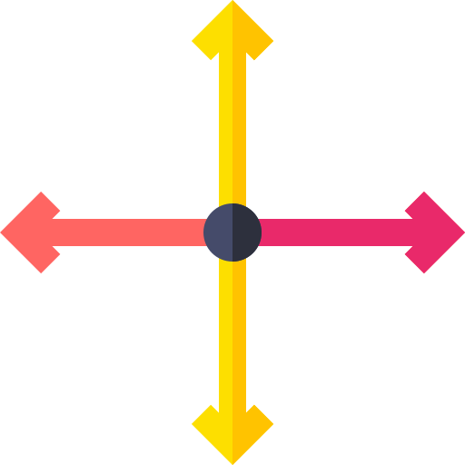

# 🛠️ ISTools Plugin for QGIS

<div align="center">


**Advanced Vector Processing Tools for QGIS**

<div align="center">
  
🌐 **[🚀 VISIT OUR OFFICIAL WEBSITE - CLICK HERE! 🚀](https://irlansouza93.github.io/istools-website/)**

*Discover more plugins, tutorials and exclusive resources for QGIS!*

</div>

[](https://qgis.org)
[](https://github.com/irlansouza93/istools)
[](LICENSE.txt)
[](https://python.org)
[](https://irlansouza93.github.io/istools-website/)

*Enhance your QGIS workflow with powerful vector processing capabilities*

</div>

---

## 🌟 Overview

**ISTools** is a comprehensive QGIS plugin that provides essential vector data processing tools designed to streamline your GIS workflow. Whether you're working with lines, polygons, or points, ISTools offers intuitive solutions for common geometric operations with support for multiple coordinate reference systems.

## ✨ Features

### 🔧 Available Tools

| Tool | Description | Icon |
|------|-------------|------|
| **🔗 Extend Lines** | Extend line geometries by specified distances at start/end points |  |
| **📐 Polygon Generator** | Create polygons from selected points with customizable parameters |  |
| **🎯 Bounded Polygon Generator** | Generate polygons within specified boundary constraints |  |
| **📍 Point on Surface Generator** | Generate representative points guaranteed to be on polygon surfaces |  |
| **✂️ Intersection Line** | Insert shared vertices at line intersections within a selected area |  |

### 🚀 Key Capabilities

- ✅ **Multi-CRS Support** - Works seamlessly with different coordinate reference systems
- ✅ **Batch Processing** - Process multiple features simultaneously
- ✅ **Interactive Interface** - User-friendly dialogs with real-time feedback
- ✅ **Multilingual** - Available in English and Portuguese (Brazil)
- ✅ **QGIS Integration** - Native integration with QGIS processing framework

---

## 📋 Requirements

- 🖥️ **QGIS**: Version 3.0 or higher
- 📊 **Data**: Vector layers (points, lines, or polygons)
- 🗺️ **CRS**: Appropriate coordinate reference system for your data

---

## 🔧 Installation

### 📦 From QGIS Plugin Repository (Recommended)

1. Open QGIS
2. Navigate to **Plugins** → **Manage and Install Plugins**
3. Search for **"ISTools"**
4. Click **Install Plugin**

### 📁 Manual Installation

1. Download the latest `istools_v1.3.zip` from releases
2. Open QGIS
3. Go to **Plugins** → **Manage and Install Plugins**
4. Click **Install from ZIP**
5. Select the downloaded ZIP file
6. Click **Install Plugin**

### 👨‍💻 Development Installation

```bash
# Clone the repository
git clone https://github.com/irlansouza93/istools.git

# Navigate to QGIS plugins directory
cd ~/.local/share/QGIS/QGIS3/profiles/default/python/plugins/

# Create symbolic link (Linux/Mac) or copy folder (Windows)
ln -s /path/to/istools/istools ./istools
```

---

## 🎯 Usage Guide

### 🔗 Extend Lines Tool

Perfect for extending line geometries in both directions:

1. **Select** a line layer in the Layers Panel
2. **Access** the tool via ISTools toolbar or menu
3. **Configure** extension parameters:
   - Start distance (meters)
   - End distance (meters)
   - Output layer name
4. **Execute** and review results

### 📐 Polygon Generator Tool

Create polygons from point collections:

1. **Select** a point layer
2. **Choose** polygon generation method
3. **Set** buffer distance and parameters
4. **Generate** polygon output

### ✂️ Intersection Line Tool

Perfect for inserting shared vertices at line intersections:

1. **Select** line layers in the Layers Panel
2. **Access** the tool via ISTools toolbar or menu
3. **Draw** a rectangle in the area where you want to process intersections
4. **Confirm** the operation and review the inserted vertices at intersections

### 🎯 Advanced Features

- **Snapping Settings**: Enable snapping for precise digitizing
- **CRS Management**: Ensure consistent coordinate systems
- **Closed Boundaries**: Maintain topology for polygon operations

---

## 💡 Tips & Best Practices

| 💡 **Tip** | **Description** |
|------------|-----------------|
| 🗺️ **CRS Consistency** | Ensure all layers use the same coordinate reference system |
| 🎯 **Snapping** | Enable snapping settings for precise geometry creation |
| 🔄 **Backup Data** | Always backup your data before processing |
| ⚡ **Performance** | For large datasets, consider processing in smaller batches |

---

## 🔧 Troubleshooting

<details>
<summary><strong>🚫 Plugin icons not showing</strong></summary>

**Solution**: Restart QGIS or refresh the interface via **View** → **Panels** → **Toolbars**
</details>

<details>
<summary><strong>❌ "No active layer" error</strong></summary>

**Solution**: Ensure you have selected an appropriate vector layer in the Layers Panel
</details>

<details>
<summary><strong>⚠️ CRS mismatch warnings</strong></summary>

**Solution**: Reproject layers to a common coordinate reference system before processing
</details>

<details>
<summary><strong>🐌 Slow performance with large datasets</strong></summary>

**Solution**: Process data in smaller chunks or consider using QGIS processing algorithms for batch operations
</details>

---

## 🤝 Contributing

We welcome contributions! Here's how you can help:

### 🐛 Bug Reports
- Use the [GitHub Issues](https://github.com/irlansouza93/istools/issues) page
- Provide detailed reproduction steps
- Include QGIS version and system information

### 💻 Code Contributions
1. Fork the repository
2. Create a feature branch: `git checkout -b feature/amazing-feature`
3. Commit changes: `git commit -m 'Add amazing feature'`
4. Push to branch: `git push origin feature/amazing-feature`
5. Open a Pull Request

### 🌍 Translations
Help translate ISTools to your language! Translation files are located in the `i18n/` directory.

---

## 📄 License

This project is licensed under the **GNU General Public License v3.0** - see the [LICENSE.txt](LICENSE.txt) file for details.

---

## 👨‍💻 Author & Support

<div align="center">

**Developed by [Irlan Souza](https://github.com/irlansouza93)**

[](https://github.com/irlansouza93)
[](mailto:irlansouza@example.com)
[](https://irlansouza93.github.io/istools-website/)

### 📚 **Documentation & Tutorials**
Visit the [**official ISTools website**](https://irlansouza93.github.io/istools-website/) for:
- 📖 Detailed tutorials for each tool
- 🎥 Step-by-step guides
- 📋 Practical usage examples
- 🔄 Update information

---

### 🌟 **Star this repository if ISTools helped you!** ⭐

*Made with ❤️ for the QGIS community*

</div>