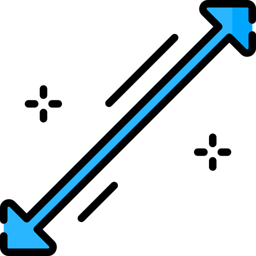
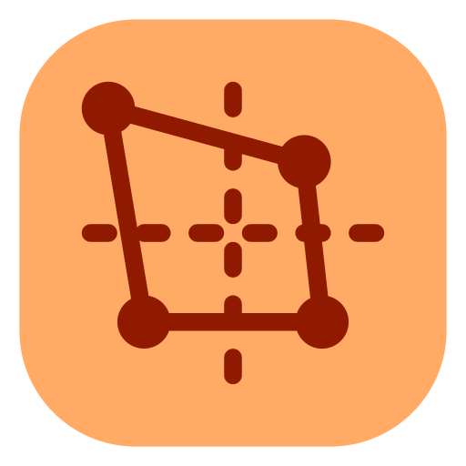

# 🛠️ Plugin ISTools para QGIS

<div align="center">


**Ferramentas Avançadas de Processamento Vetorial para QGIS**

<div align="center">
  
🌐 **[🚀 VISITE NOSSO SITE OFICIAL - CLIQUE AQUI! 🚀](https://irlansouza93.github.io/istools-website/)**

*Descubra mais plugins, tutoriais e recursos exclusivos para QGIS!*

</div>

[](https://qgis.org)
[](https://github.com/irlansouza/istools)
[](LICENSE.txt)
[](https://python.org)

*Aprimore seu fluxo de trabalho no QGIS com poderosas capacidades de processamento vetorial*

</div>

---

## 🌟 Visão Geral

**ISTools** é um plugin abrangente para QGIS que fornece ferramentas essenciais de processamento de dados vetoriais projetadas para otimizar seu fluxo de trabalho em SIG. Seja trabalhando com linhas, polígonos ou pontos, o ISTools oferece soluções intuitivas para operações geométricas comuns com suporte para múltiplos sistemas de referência de coordenadas.

## ✨ Funcionalidades

### 🔧 Ferramentas Disponíveis

| Ferramenta | Descrição | Ícone |
|------------|-----------|-------|
| **🔗 Estender Linhas** | Estende geometrias de linha por distâncias especificadas nos pontos inicial/final |  |
| **📠Gerador de Polígonos** | Cria polígonos a partir de pontos selecionados com parâmetros personalizáveis |  |
| **🯠Gerador de Polígonos Limitados** | Gera polígonos dentro de restrições de limite especificadas |  |
| **📠Gerador de Pontos na Superfície** | Gera pontos representativos garantidos de estar nas superfícies dos polígonos |  |
| **✂️ Interseção de Linhas** | Insere vértices compartilhados nas interseções de linhas dentro de uma área selecionada |  |

### 🚀 Capacidades Principais

- ✅ **Suporte Multi-SRC** - Funciona perfeitamente com diferentes sistemas de referência de coordenadas
- ✅ **Processamento em Lote** - Processa múltiplas feições simultaneamente
- ✅ **Interface Interativa** - Diálogos amigáveis com feedback em tempo real
- ✅ **Multilíngue** - Disponível em Inglês e Português (Brasil)
- ✅ **Integração QGIS** - Integração nativa com o framework de processamento do QGIS

---

## 📋 Requisitos

- 🖥️ **QGIS**: Versão 3.0 ou superior
- 📊 **Dados**: Camadas vetoriais (pontos, linhas ou polígonos)
- 🗺️ **SRC**: Sistema de referência de coordenadas apropriado para seus dados

---

## 🔧 Instalação

### 📦 Do Repositório de Plugins do QGIS (Recomendado)

1. Abra o QGIS
2. Navegue para **Plugins** → **Gerenciar e Instalar Plugins**
3. Procure por **"ISTools"**
4. Clique em **Instalar Plugin**

### 📁 Instalação Manual

1. Baixe o arquivo `istools_v1.3.zip` mais recente das releases
2. Abra o QGIS
3. Vá para **Plugins** → **Gerenciar e Instalar Plugins**
4. Clique em **Instalar do ZIP**
5. Selecione o arquivo ZIP baixado
6. Clique em **Instalar Plugin**

### 👨‍💻 Instalação para Desenvolvimento

```bash
# Clone o repositório
git clone https://github.com/irlansouza93/istools.git

# Navegue para o diretório de plugins do QGIS
cd ~/.local/share/QGIS/QGIS3/profiles/default/python/plugins/

# Crie um link simbólico (Linux/Mac) ou copie a pasta (Windows)
ln -s /caminho/para/istools/istools ./istools
```

---

## 🎯 Guia de Uso

### 🔗 Ferramenta Estender Linhas

Perfeita para estender geometrias de linha em ambas as direções:

1. **Selecione** uma camada de linha no Painel de Camadas
2. **Acesse** a ferramenta via barra de ferramentas ou menu do ISTools
3. **Configure** os parâmetros de extensão:
   - Distância inicial (metros)
   - Distância final (metros)
   - Nome da camada de saída
4. **Execute** e revise os resultados

### 📐 Ferramenta Gerador de Polígonos

Crie polígonos a partir de coleções de pontos:

1. **Selecione** uma camada de pontos
2. **Escolha** o método de geração de polígonos
3. **Defina** a distância do buffer e parâmetros
4. **Gere** a saída do polígono

### ✂️ Ferramenta Interseção de Linhas

Perfeita para inserir vértices compartilhados em interseções de linhas:

1. **Selecione** camadas de linha no Painel de Camadas
2. **Acesse** a ferramenta via barra de ferramentas ou menu do ISTools
3. **Desenhe** um retângulo na área onde deseja processar as interseções
4. **Confirme** a operação e revise os vértices inseridos nas interseções

### 🎯 Funcionalidades Avançadas

- **Configurações de Snap**: Habilite o snap para digitalização precisa
- **Gerenciamento de SRC**: Garanta sistemas de coordenadas consistentes
- **Limites Fechados**: Mantenha a topologia para operações de polígonos

---

## 💡 Dicas e Melhores Práticas

| 💡 **Dica** | **Descrição** |
|-------------|---------------|
| 🗺️ **Consistência de SRC** | Garanta que todas as camadas usem o mesmo sistema de referência de coordenadas |
| 🎯 **Snap** | Habilite as configurações de snap para criação precisa de geometrias |
| 🔄 **Backup de Dados** | Sempre faça backup dos seus dados antes do processamento |
| ⚡ **Performance** | Para grandes conjuntos de dados, considere processar em lotes menores |

---

## 🔧 Solução de Problemas

<details>
<summary><strong>🚫 Ícones do plugin não aparecem</strong></summary>

**Solução**: Reinicie o QGIS ou atualize a interface via **Exibir** → **Painéis** → **Barras de Ferramentas**
</details>

<details>
<summary><strong>❌ Erro "Nenhuma camada ativa"</strong></summary>

**Solução**: Certifique-se de ter selecionado uma camada vetorial apropriada no Painel de Camadas
</details>

<details>
<summary><strong>⚠️ Avisos de incompatibilidade de SRC</strong></summary>

**Solução**: Reprojete as camadas para um sistema de referência de coordenadas comum antes do processamento
</details>

<details>
<summary><strong>🐌 Performance lenta com grandes conjuntos de dados</strong></summary>

**Solução**: Processe os dados em pedaços menores ou considere usar algoritmos de processamento do QGIS para operações em lote
</details>

---

## 🤝 Contribuindo

Damos as boas-vindas às contribuições! Veja como você pode ajudar:

### 🐛 Relatórios de Bugs
- Use a página [GitHub Issues](https://github.com/irlansouza/istools/issues)
- Forneça passos detalhados de reprodução
- Inclua a versão do QGIS e informações do sistema

### 💻 Contribuições de Código
1. Faça um fork do repositório
2. Crie uma branch de funcionalidade: `git checkout -b feature/funcionalidade-incrivel`
3. Faça commit das mudanças: `git commit -m 'Adiciona funcionalidade incrível'`
4. Faça push para a branch: `git push origin feature/funcionalidade-incrivel`
5. Abra um Pull Request

### 🌍 Traduções
Ajude a traduzir o ISTools para seu idioma! Os arquivos de tradução estão localizados no diretório `i18n/`.

---

## 📄 Licença

Este projeto está licenciado sob a **Licença Pública Geral GNU v3.0** - veja o arquivo [LICENSE.txt](LICENSE.txt) para detalhes.

---

## 👨‍💻 Autor e Suporte

<div align="center">

**Desenvolvido por [Irlan Souza](https://github.com/irlansouza)**

[](https://github.com/irlansouza)
[](mailto:irlansouza@example.com)

---

### 🌟 **Dê uma estrela neste repositório se o ISTools te ajudou!** ⭐

*Feito com ❤️ para a comunidade QGIS*

</div>